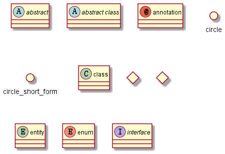

# 第1章 撰写并发布文档的正确姿势
## 总体流程
<!-- 
```mermaid

    sequenceDiagram
      participant Alice
      participant Bob
      Alice->John: Hello John, how are you?
``` -->
<!--  -->

<!--  -->
- 下载项目
```bash
git clone git@github.com:xyg1996/xyg_read_write.git
cd .\xyg_read_write\ 
```
- 使用VScode或其他工具，确保Python3环境配置完毕。建议使用集成开发环境[Anaconda](https://zhuanlan.zhihu.com/p/416420836)。

- 安装Python依赖包
```bash
pip install .[doc]
```

- 撰写Markdown文件

- 编译
    - 不预览只生成html
    ```bash
    cd .\docs
    .\make.bat html
    ```
    成功后，在docs目录下的build文件夹下生成html文件
    - 本地预览且生成html
    ```bash
    cd .\xyg_read_write\ 
    sphinx-autobuild.exe .\docs\source\ .\docs\build\html\
    ```
    成功后浏览器访问 [http://127.0.0.1:8000](http://127.0.0.1:8000) 即可查看文档效果。且每次更改文档后，将自动编译，适合实时撰写查看。

- 提交至github
    ```bash
    git push origin main
    ```
- read the docs发布
read the docs是一个文档托管网站，将本地编译通过的文档上传至read the docs的服务器进行编译，即可生成在线文档。当然，需要在.readthedocs.yaml中写好配置文件。
具体流程参考[官方文档第一节](https://docs.readthedocs.io/en/stable/tutorial/)。

## 其他插件

使用markdown的时候总是会使用到一些插件，例如mermaid这类绘图工具。如果引入这些工具的代码，直接一步到位build html可能有些困难，可以通过引入图片的方式解决这个问题，这个时候VScode丰富的插件功能就派上用场了！

- mermaid
Vscode安装插件Mermaid Editor，编写*.mmd格式文件导出*.svg格式矢量图片。之后在Markdown文件中引用图片即可。该方案的好处是可以预览的同时导出图片。
```bash

```
- plantuml
项目中已有所需可执行文件，无需安装插件，执行以下命令即可将*.puml转换为*.svg图片。
```bash
cd .\docs\
./source/utils/plantuml.jar -svg -o ../images/uml/ ./source/uml/*.puml
```
预览*.puml可安装插件PlantUML -Simple Viewer

## Q & A
- Q1：为何使用read the docs？
    1. 不需要注册域名、买服务器、建网站等，方便分享文档；
    2. 可以享受托管网站的功能，例如发布多个文档版本、版本控制，常用格式（PDF、EQUB）下载。