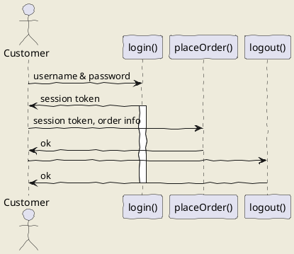

# 第1章 撰写并发布文档的正确姿势
## 总体流程

```{mermaid}

    sequenceDiagram
      participant Alice
      participant Bob
      Alice->John: Hello John, how are you?
```
Here I will embed PlantUML markup to generate a sequence diagram.

I can include as many plantuml segments as I want in my Markdown, and the diagrams can be of any type supported by PlantUML.


